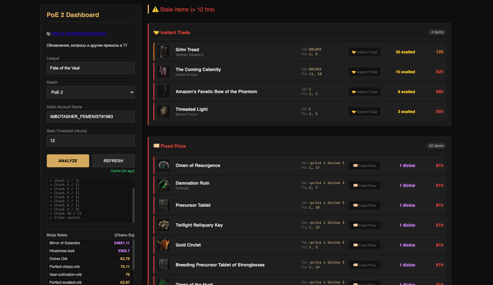

# 🛠 PoE Trade 2 Dashboard

  

> **English Description:**  
> **PoE Trade 2 Dashboard** is a free Chrome Extension for **Path of Exile 2**. It provides advanced trade analytics: calculates total **stash value**, highlights **stale items** (unsold for too long), and displays live currency rates from **poe.ninja**. Secure, local execution using the official Trade API.

---

### 🇷🇺 Описание проекта

**PoE Trade 2 Dashboard** — это расширение для браузера Chrome, которое помогает не забывать про вещи в стэш трейде.

Представьте, что GGG сделали удобный интерфейс: он показывает завалявшиеся вещи, подсказывает, что пора репрайсить, и считает, сколько валюты лежит в ваших вкладках. Поскольку разработчики этого не сделали, это расширение делает всё за них.

**📢 Telegram канал автора:** [Sphere of Automation](https://t.me/SphereofAutomation)  
*(Обновления, вопросы и обсуждения)*

## ✨ Возможности

*   **📊 Stale Items Analysis (Залежавшийся товар):** Находит предметы, которые висят в продаже дольше указанного времени (например, 48 часов) и требуют снижения цены.
*   **💰 Total Revenue (Подсчет вэлью):** Считает общую ожидаемую выручку со всех выставленных товаров, конвертируя всё в Хаосы.
*   **📉 Live Rates:** Отображает актуальные курсы валют с [poe.ninja](https://poe.ninja) (Divine, Exalted, Mirror) прямо в сайдбаре.
*   **🕵️‍♂️ Multi-Account:** Можно проанализировать не только свой аккаунт, но и посмотреть стэш друга (или конкурента).
*   **🔒 Безопасность:** Работает локально в браузере. Никакие данные (логины, сессии) не передаются на сторонние сервера.

---

## 🚀 Установка

Так как это Open Source проект, установка происходит в режиме разработчика (это безопасно и занимает 1 минуту):

1. **Скачайте:**
   - С вкладки Релизы [Releases](https://github.com/GafGafGaf5612/PoE-Trade-2-Dashboard/releases/)
   - *Или через git:* `git clone https://github.com/GafGafGaf5612/poe-trade-2-dashboard.git`
2. **Откройте расширения Chrome:**
   - Введите в адресную строку: `chrome://extensions/`
3. **Включите Developer Mode:**
   - Переключатель в правом верхнем углу **«Режим разработчика»**.
4. **Загрузите:**
   - Нажмите кнопку **«Загрузить распакованное» (Load unpacked)**.
   - Выберите папку, куда вы распаковали файлы.
5. **Готово!** Иконка пазла 🧩 появится в панели браузера.

---

## ⚙️ Как пользоваться

⚠️ **Важно:** Для работы вы должны быть авторизованы на [pathofexile.com/trade2](https://www.pathofexile.com/trade2) в этом же браузере.

1. Открываем расширение.
2. **League:** Указываем текущую лигу (по умолчанию `Fate of the Vaal`).
3. **Realm:** Выбираем `PoE 2`.
4. **Seller Account Name:** Вписываем имя аккаунта (формат `Name#1234`, виден на сайте PoE слева сверху).
5. **Stale Threshold:** Через сколько дней считать товар "тухлым" (например, 3 дня).
6. Жмем **ANALYZE**.

Слева в логах побежит статус загрузки. После завершения справа появится полный отчет.

---

## 🛠 Технологии и Кредиты

*   **Stack:** HTML5, CSS3, Vanilla JS (Manifest V3).
*   **APIs:** Path of Exile Official Trade API, poe.ninja API.

### 🤖 AI Contribution
В разработке, рефакторинге кода и написании документации участие принимала модель **models/gemini-3-pro-preview**.

---

## 🛡 Disclaimer & Privacy

*   Проект с открытым исходным кодом. Вы можете изучить `dashboard.js`, чтобы убедиться в безопасности.
*   Расширение соблюдает Rate Limits (лимиты запросов) GGG, но используйте кнопку Refresh с умом, чтобы не получить временный тайм-аут на трейд-сайте.
